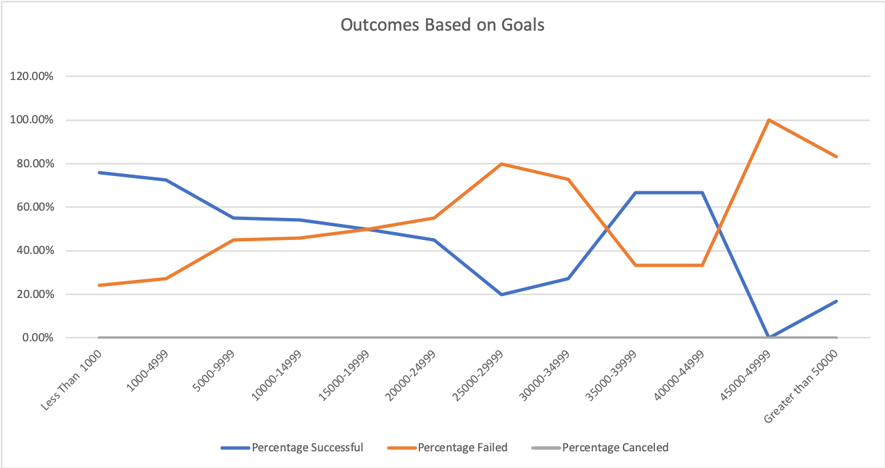

# kickstarter-analysis
Performing analysis on a kickstarter data to uncover trends.
## Overview of Project
The kickstarter data which contains the information of all fundraising campaign in different countries and categories, campaign goal and amount pledged in different currencies, date launched and deadline, and outcomes. We were asked to assist Louise with the analysis of different campaigns in the same category as his play - Fever in order to predict the outcome based on previous campaigns'launch date and funding goal.
### Purpose
The purpose of this analysis is to help Louise analyze how different campaigns fared in relation to their launch dates and their funding goals.
## Analysis and Challenges
We have performed two analysis as follows:
### Analysis of Outcomes Based on Launch Date
Theatre outcomes based on the launch date line chart analyzes the relationship between month of the year that the campaign is being launched and the percentage of outcome of successful, canceled, and failed.

### Analysis of Outcomes Based on Goals
Outcomes based on goals analyze the relationship of category plays campaign's outcomes (percentage of successful, percentage of failed, and percentage of canceled) and the play campaign funding goals which has been grouped in the increment of approximately 5000. 

### Challenges and Difficulties Encountered
There is outlier in the dataset making it difficult to conclude the result. By performing the IQR analysis, we are able to determine the outliers in the data set.
## Results
The most successful launch month is May and from May onward, the successful percentage shows downward trends. The analysis also shows that the campaign with funding goals less than 20,000 are more likely to be successful and greater than 20,000 are more likely to fail. 

Limitation to the data set: 
1. The date of campaigns launched are only from 2009-2017. Recent launch can provide additional information to the analysis. 
2. Currency will need conversion in order to provide accurate global analysis.
3. Play category may not provide the most accurate comparision/ prediction.

Potential future analysis:
1. Linear regression between goal and percentage of success
2. Line chart showing the duration of campaign and percentage of success
